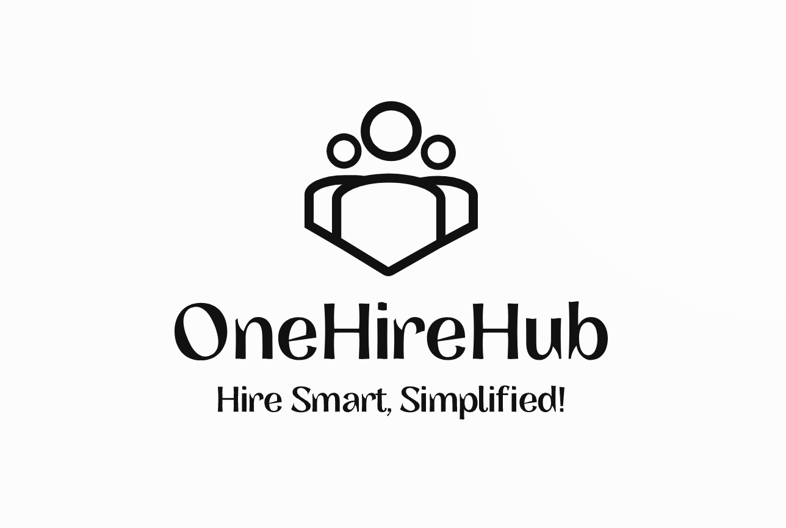
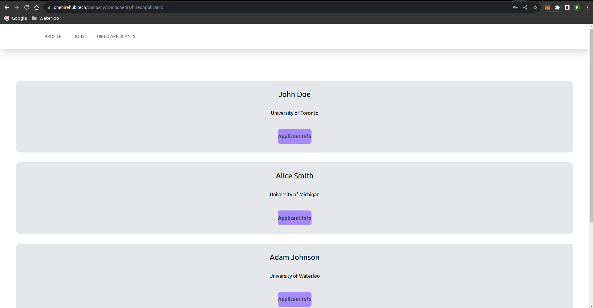
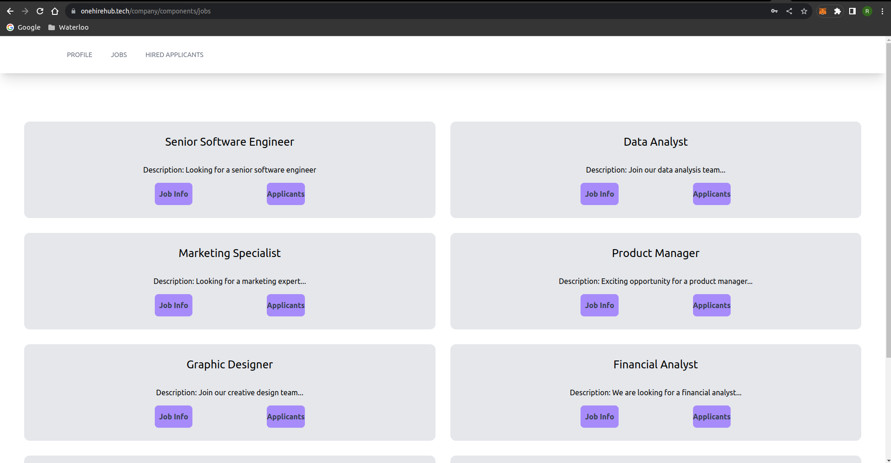
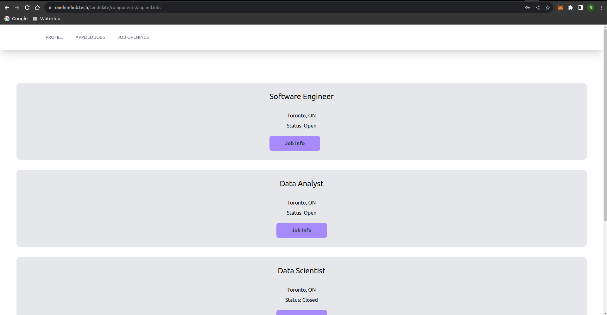
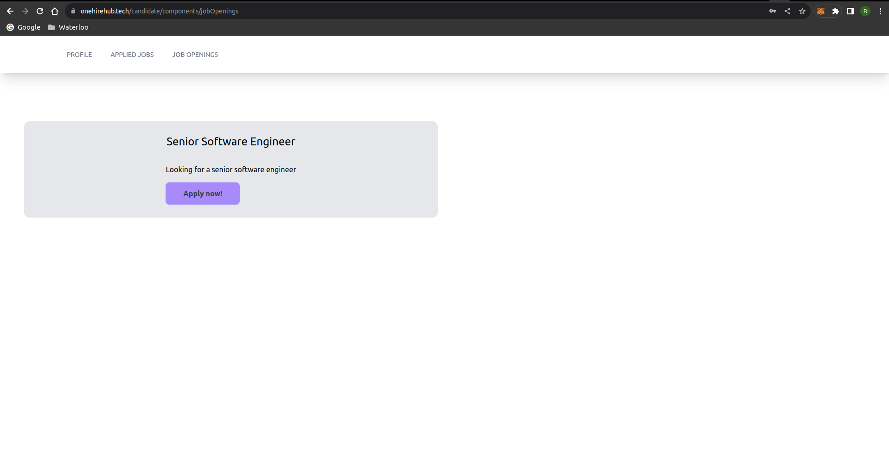

# **OneHireHub** - Hack The North 2023

## Project Overview

Welcome to _One Hiring Hub_, where the future of recruitment meets innovation. Born from the minds of visionaries at Hack The North 2023, this project isn't just an advancement; it's a revolution that transforms the way we approach hiring and HR management.

#### Recruiter Interface

#### Candidate Interface

### Elevating the Game with Technology

One Hiring Hub isn't your run-of-the-mill recruitment platform; it's a technological marvel that empowers both employers and job seekers like never before. Here's what sets it apart:

### Key Technological Marvels

- _Advanced Candidate Assessment:_ We've harnessed the might of state-of-the-art Natural Language Processing (NLU) and Optical Character Recognition (OCR) services, elevating candidate evaluation beyond mere keyword searches.

- _Effortless Background Checks:_ Our platform redefines background verification by automating the process, saving time and resources while maintaining unparalleled security and precision.

- _Training and Skill Empowerment:_ We go beyond recruitment, offering a wealth of training resources and skill development opportunities, preparing candidates for excellence in their careers.

- _HR Management Excellence:_ For employers, One Hiring Hub delivers a suite of HR management tools that simplify complex tasks like onboarding and performance evaluation through intuitive, tech-driven solutions.

### The Architecture Behind the Innovation

One Hiring Hub's heart lies in its robust system architecture, featuring:

- _OCR Service:_ The gateway to extracting valuable text data from resumes and documents with surgical precision.

- _NLU Service:_ The AI brain that understands the intricacies of resume content, driven by cutting-edge Natural Language Understanding.

- _App Server Cluster:_ The powerhouse that hosts our ingenious application logic, seamlessly connecting with external services.

- _Cockroach DB:_ Our data fortress, ensuring unwavering data reliability and limitless scalability.

- _Vector Database:_ The magician behind text processing and analysis, fueling our intelligent platform.

- _S3 (Simple Storage Service):_ The guardian of files and documents, protecting your data with military-grade security.

### The Technology Stack

In our quest to redefine recruitment, we've wielded an array of technologies:

- _Django:_ The bedrock of our backend, providing stability and scalability.

- _Python:_ The language of innovation, driving the intelligent algorithms behind One Hiring Hub.

- _Next.js:_ Energizing our frontend with dynamic, responsive, and interactive interfaces.

- _Solidity and Truffle:_ Our foray into blockchain development, enhancing transparency and trust.

- _AWS (Amazon Web Services):_ The cloud powerhouse supporting our platform's limitless scalability and rock-solid reliability.

- _Gnash:_ Our data analysis ally, providing insights that guide informed decisions.

- _CockroachDB:_ The proven database that ensures One Hiring Hub performs flawlessly under the heaviest loads.

## The Revenue Model

Now, let's unveil the surprise – our revenue model:

### _Subscription Plans for Employers_

- _Basic Plan:_ Providing access to candidate database and fundamental job posting tools.

  - Pricing: $X per month or $Y per year.

- _Premium Plan:_ Elevating the experience with advanced candidate search, analytics, and priority support.

  - Pricing: $2X per month or $2Y per year.

- _Enterprise Plan:_ Tailored solutions for large organizations, offering custom branding and API access.
  - Pricing: Customized to organization size and needs.

### _Job Promotion and Featured Listings_

- _Featured Job Listings:_ Employers can boost visibility with prominently displayed job listings for an additional fee.

- _Job Promotion:_ Amplify job visibility through premium promotion in search results.

### _Recruitment Advertising_

- Provide advertising opportunities for HR-related products and services, targeting HR professionals and recruiters.

### _Premium Candidate Services (Optional)_

- Candidates can opt for premium services such as resume review, interview coaching, and personal branding for a fee.

### _Referral and Affiliate Programs_

- Incentivize user referrals with rewards or discounts on subscription plans for successful referrals.

### _Data and Analytics Insights_

- Offer premium data reports and analytics to organizations seeking market insights.

## Join the Revolution

We invite tech enthusiasts, developers, data scientists, designers, and visionary thinkers to join us in reshaping the future of recruitment. Contribute, innovate, and make your mark in the journey to transform hiring and HR management.

## The Future Awaits

Our path forward is one of ambition and innovation:

- _Global Expansion:_ We'll reach emerging markets and customize our platform for diverse regions.

- _AI Excellence:_ Continuously refine AI algorithms for precise CV analysis and automation in HR tasks.

- _Strategic Partnerships:_ Collaborate with educational institutions and integrate with HR software systems for unparalleled user experiences.

- _Premium Candidate Services:_ Offer premium services to candidates for career excellence.

- _Data Insights Revolution:_ Provide premium data analytics to organizations hungry for market insights.

## Get in Touch

For inquiries, collaboration opportunities, or simply to be part of this revolution, reach out to us at [daemononcode@gmail.com](mailto:daemononcode@gmail.com).

Join us on this thrilling journey to redefine the future of hiring and HR management. Together, we're unstoppable!

# Thank You!

<h1 align="center"> Contributors </h1>
<table align="center">
<tr align="center">
<td>
<strong>Ansh Sharma</strong>

</td>
<td>
<strong>Puneet Gupta</strong>

</td>
<td>
<strong>Eugene Tye</strong>

</td>
</tr>
</table>
</tr>
</table>
